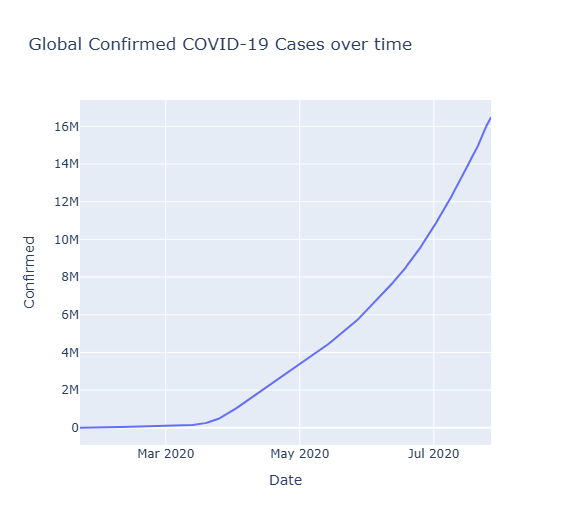
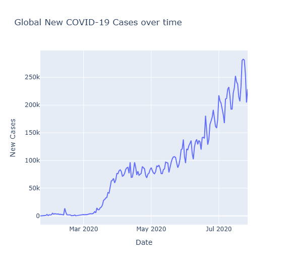
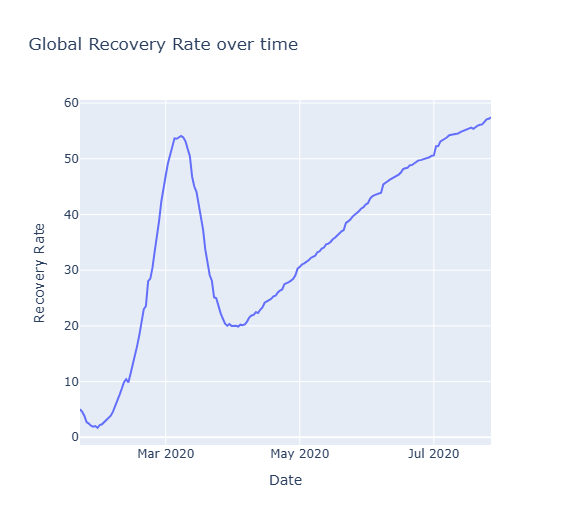
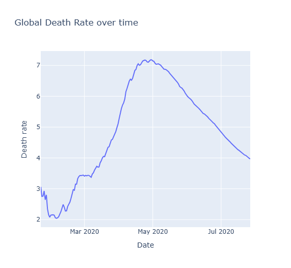
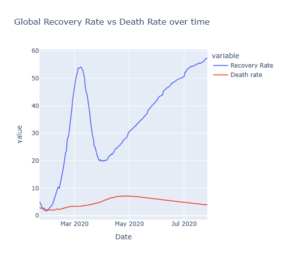
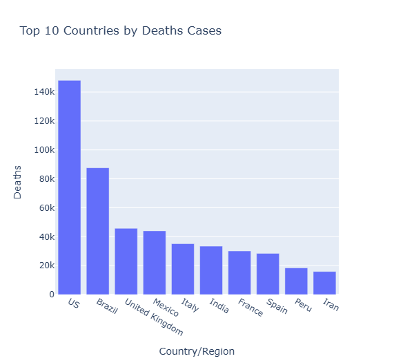
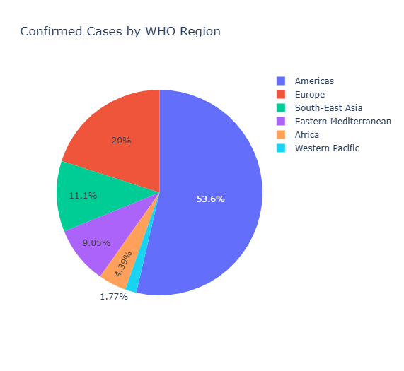
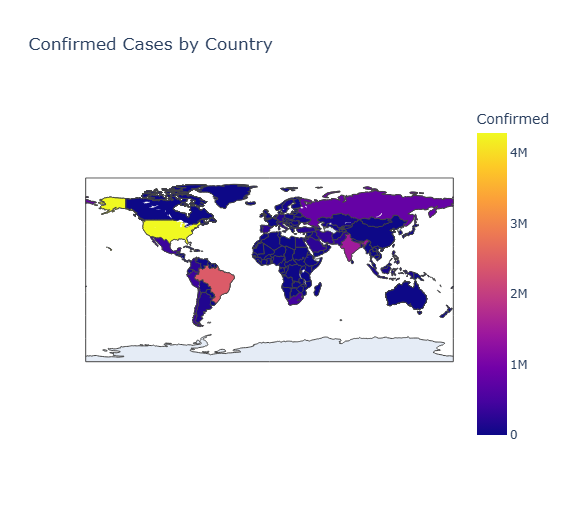

# COVID-19 Global Trend Analysis and Forecasting

## Project Overview

This project analyzes the global spread of COVID-19 using data collected from 187 countries between January 2020 and July 2020.

The project focuses on:

- Infection trend analysis
- Recovery rate analysis
- Death rate analysis
- Country-wise impact assessment
- WHO region-wise distribution
- Time-series forecasting using Facebook Prophet

Interactive visualizations were developed using Plotly, while Pandas was used for data preprocessing and aggregation.

---

## Objectives

- Analyze the progression of COVID-19 across the world.
- Study daily infection trends.
- Evaluate recovery and death rates over time.
- Identify the most affected countries and regions.
- Forecast future confirmed cases using Prophet.

---

## Technologies Used

- Python
- Pandas
- NumPy
- Plotly
- Prophet
- Google Colab
- GitHub

---

## Dataset

**Dataset:** COVID-19 Clean Complete Dataset

### Features

- Date
- Country/Region
- Confirmed Cases
- Deaths
- Recovered Cases
- Active Cases
- WHO Region

### Dataset Statistics

- Records: 49,068
- Countries Covered: 187
- Time Period: 22 January 2020 – 27 July 2020

---

## Project Structure

```text
COVID19-Global-Trend-Forecasting
│
├── data
│   └── covid_19_clean_complete.csv
│
├── docs
│
├── images
│   ├── confirmed_case_trend.png
│   ├── daily_new_cases.png
│   ├── death_rate.png
│   ├── recovery_rate.png
│   ├── recovery_vs_death_rate.png
│   ├── top_10_countries_by_confirmed_cases.png
│   ├── top_10_countries_by_death_cases.png
│   ├── who_region_analysis.png
│   ├── world_map.png
│   └── prophet_forecast.png
│
├── notebooks
│   └── COVID19_Analysis_and_Forecasting.ipynb
│
├── requirements.txt
├── LICENSE
├── README.md
└── .gitignore
```

---

## Exploratory Data Analysis

### Global Confirmed Cases Trend

Analyzed cumulative confirmed COVID-19 cases over time.



---

### Daily New Cases

Analyzed daily infection growth using first-order differencing.



---

### Recovery Rate Analysis

Recovery Rate = (Recovered / Confirmed) × 100



---

### Death Rate Analysis

Death Rate = (Deaths / Confirmed) × 100



---

### Recovery Rate vs Death Rate

Comparison of recovery and mortality trends throughout the pandemic.



---

### Top 10 Countries by Confirmed Cases


---

### Top 10 Countries by Death Cases



---

### WHO Region Analysis

Distribution of confirmed cases across WHO regions.



---

### Global COVID-19 Map

Global geographical distribution of confirmed COVID-19 cases.



---

## Forecasting Using Facebook Prophet

A Prophet-based forecasting model was developed to predict future confirmed COVID-19 cases.

### Prophet Forecast


The model was trained using historical global confirmed case data and used to forecast the next seven days of infections.

---

## Key Findings

- Global confirmed cases exhibited exponential growth during the study period.
- Daily infection rates increased significantly after March 2020.
- Recovery rates improved steadily, reaching over 57% by July 2020.
- Death rates peaked around May 2020 and gradually declined.
- The Americas accounted for more than 50% of global confirmed cases.
- The United States, Brazil, and India were the most affected countries.
- Prophet forecasting predicted continued growth in confirmed cases during the following week.

---

## Future Scope

- Forecast deaths and recoveries separately.
- Compare country-specific infection trends.
- Develop interactive dashboards using Streamlit.
- Evaluate forecasting accuracy using error metrics.

---

## Author

**Shruti Turare**

B.Tech, Chemical Engineering  
Indian Institute of Technology Indore
